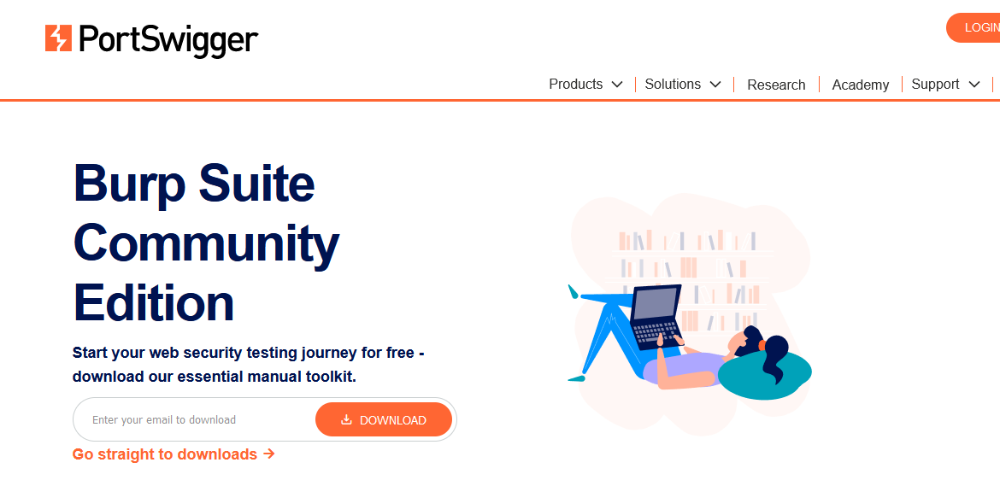
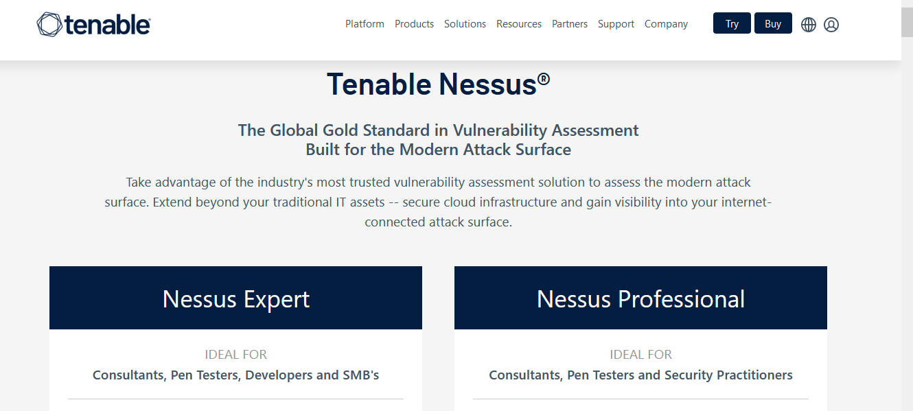
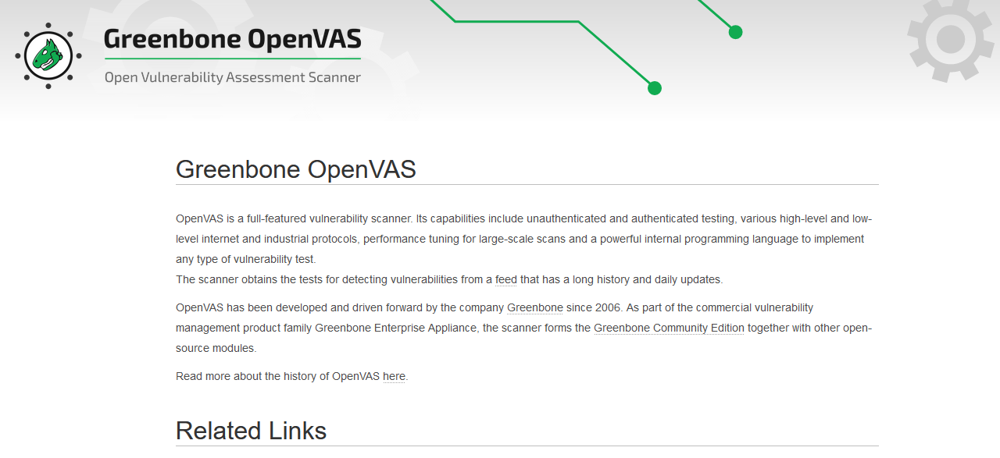

# Analisis de la Infomacion 

Es el segundo punto que debemos realizar en nuestra `Auditiria Web` esta técnica se utiliza para identificar debilidades y fallos de seguridad en sistemas, redes o aplicaciones. Al realizar un escaneo de vulnerabilidades, puedes detectar posibles puntos débiles que podrían ser explotados y puedesn comprometer la seguridad de un sistema.


## Nmap

Es una herramienta de código abierto que se utiliza para realizar escaneos de redes y sistemas. Con Nmap, puedes obtener información sobre los puertos abiertos en un sistema, identificar el tipo de servicio que se está ejecutando en cada puerto y determinar qué sistemas están activos en la red.


### Instalacion
```ssh
sudo apt install nmap
```

### Sitio Web

- https://nmap.org/


## Maltego

Con Maltego, puedes obtener información sobre entidades digitales como personas, organizaciones, sitios web, direcciones de correo electrónico, etc. También te permite visualizar y analizar las relaciones entre estas entidades. Es útil para identificar a quién pertenece un sitio web o extraer información relevante para la investigación de ciberseguridad.

### Instalacion
```ssh
sudo apt install maltego
```

### Sitio Web

- https://nmap.org/


## OWASP ZAP

Se utiliza para identificar y explotar vulnerabilidades en aplicaciones web. Con ZAP, puedes realizar pruebas de penetración en sitios web para descubrir posibles vulnerabilidades, como inyecciones SQL, cross-site scripting (XSS), inyecciones de comandos, entre otros. 

### Instalacion
```ssh
sudo apt install zaproxy
```

### Sitio Web

- https://nmap.org/


-------------------------
# Herramientas Opcionales

## Burp Suite

Se utiliza para realizar pruebas de penetración y encontrar vulnerabilidades en aplicaciones web, lo que ayuda a los desarrolladores y administradores de sistemas a identificar y solucionar problemas de seguridad antes de que sean explotados por atacantes.

#### Sitio Web

- https://portswigger.net/burp



## Nessus

Es un escáner de vulnerabilidades que permite identificar y evaluar posibles debilidades y fallos de seguridad en sistemas, redes y aplicaciones. Proporciona un análisis exhaustivo y en profundidad, ofreciendo recomendaciones para mitigar los riesgos identificados.

#### Sitio Web

- https://www.tenable.com/products/nessus




## OpenVas

Es otra herramienta de escaneo de vulnerabilidades que ayuda a descubrir debilidades en redes y sistemas. Es una alternativa de código abierto al software comercial Nessus y permite detectar y evaluar vulnerabilidades de seguridad de manera efectiva.

#### Sitio Web

- https://openvas.org/

