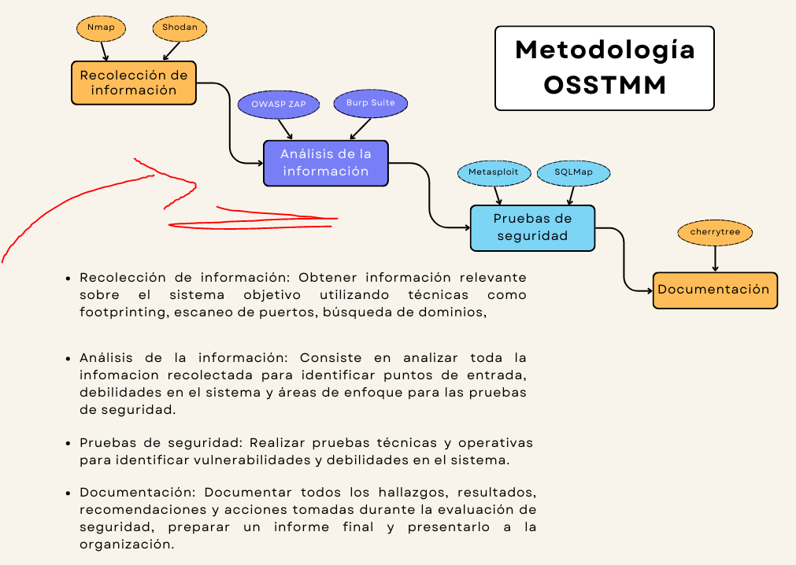
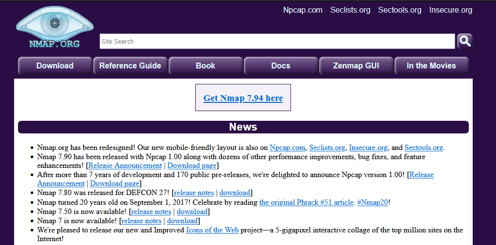
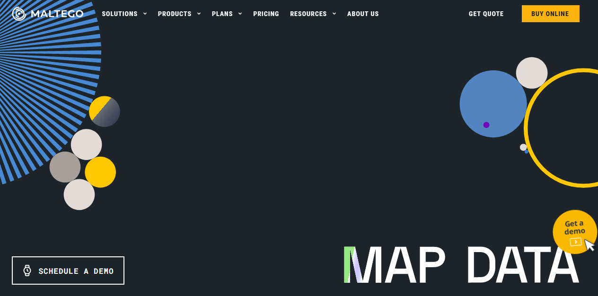
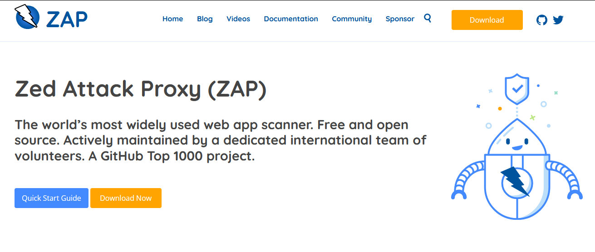

# Analisis de la Infomacion 

Es el segundo punto que debemos realizar en nuestra `Auditiria Web` esta técnica se utiliza para identificar debilidades y fallos de seguridad en sistemas, redes o aplicaciones. Al realizar un escaneo de vulnerabilidades, puedes detectar posibles puntos débiles que podrían ser explotados y puedesn comprometer la seguridad de un sistema.

## Namp

Es una herramienta de código abierto que se utiliza para realizar escaneos de redes y sistemas. Con Nmap, puedes obtener información sobre los puertos abiertos en un sistema, identificar el tipo de servicio que se está ejecutando en cada puerto y determinar qué sistemas están activos en la red.

### Sitio Web

- https://nmap.org/

## Maltego

Con Maltego, puedes obtener información sobre entidades digitales como personas, organizaciones, sitios web, direcciones de correo electrónico, etc. También te permite visualizar y analizar las relaciones entre estas entidades. Es útil para identificar a quién pertenece un sitio web o extraer información relevante para la investigación de ciberseguridad.

### Sitio Web

- https://nmap.org/

## OWASP ZAP

Se utiliza para identificar y explotar vulnerabilidades en aplicaciones web. Con ZAP, puedes realizar pruebas de penetración en sitios web para descubrir posibles vulnerabilidades, como inyecciones SQL, cross-site scripting (XSS), inyecciones de comandos, entre otros. 

### Sitio Web

- https://nmap.org/

