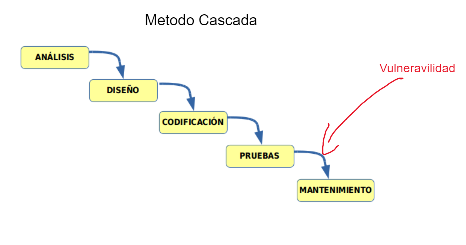

# Introduccion

Una auditoría web es un proceso esencial para evaluar y mejorar la eficiencia de un sitio web. Aquí, te proporcionaremos una serie de pasos que te ayudarán a realizar una auditoría de manera sistemática y completa.

## Ciclo para la deteccion de Vulneravilidades

Como ejemplo tenemos la intención de lanzar al mercado un software (página web, aplicación, etc.), este software se construira utilizando el `Metodo en Cascada`.

Donde este comprende de Analisis, Diseño, Codificacion, Pruebas y Mantenimiento. Es en el proceso de `Pruebas` y `Mantenimiento`, donde encuntran las brechas de Seguridad del Sistema (Vulneravilidades).

- La mayoría de las empresas tardan aproximadamente entre `100 a 120 días` en lanzar una nueva actualización. Dependiendo de la gravedad, algunas actualizaciones pueden ser lanzadas en cuestión de `días o semanas`.

- Los ataques de vulnerabilidades suelen ocurrir en `los primeros 60 días` de ha ver lanzamiento del sistema.

## Metodologia OSSTMM(Pentesting)

El OSSTMM ofrece un marco completo para realizar pruebas de seguridad. Al seguir esta metodología, vamos a obtener una visión completa de como funsiona el sistema y poder tomar medidas adecuadas para mitigar riesgos.

### Pasos a Seguir 

1. Recolección de información
2. Análisis de la información
3. Pruebas de seguridad
4. Documentación 

