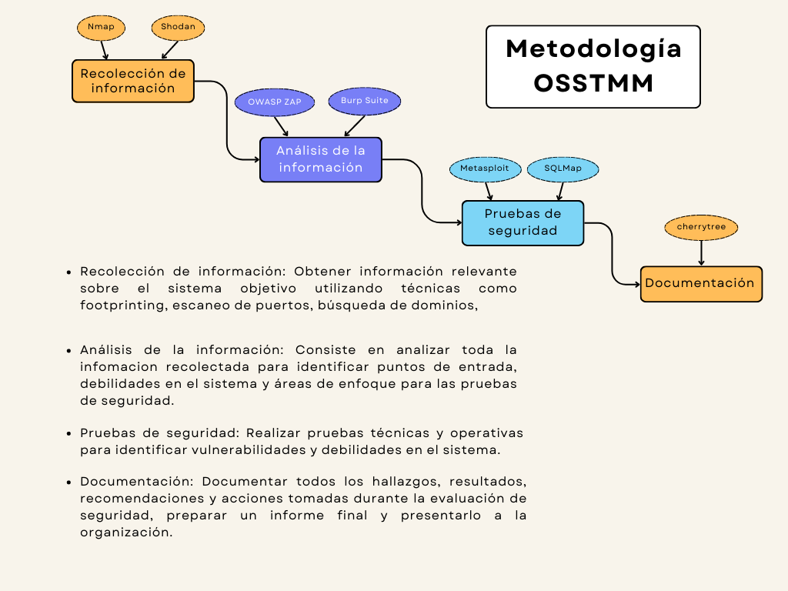

# Intruccion

Una auditoría web es un proceso esencial para evaluar y mejorar la eficiencia y efectividad de un sitio web. Aquí, te proporcionaremos una serie de pasos que te ayudarán a realizar una auditoría de manera sistemática y completa.

## Ciclo para la deteccion de Vulneravilidades

Tenemos la intención de lanzar al mercado un software (página web, aplicación, etc.), y como ejemplo utilizaremos el `Modelo de Desarrollo de Software Cascada`.

Donde se compone de Analisis, Diseño, Codificacion, Pruebas y Mantenimiento. Es en el proceso de `Pruebas` y `Mantenimiento`, es en este punto donde encuntran las brechas de Seguridad del Sistema.

- La mayoría de las empresas tardan aproximadamente de `100 a 120 días` en lanzar una nueva actualización. Sin embargo, dependiendo de la gravedad, algunas pueden lanzar actualizaciones de seguridad en cuestión de `días o semanas`.

- Los ataques de vulnerabilidades suelen ocurrir en los primeros 60 días después del lanzamiento del sistema.

## Metodologia OSSTMM(Pentesting)

El OSSTMM ofrece un marco completo para realizar pruebas de seguridad, lo que garantiza una cobertura amplia y una evaluación exhaustiva de la seguridad. Al seguir esta metodología, puedes obtener una visión integral de la postura de seguridad de un sistema y tomar medidas adecuadas para mitigar riesgos y fortalecer las defensas.

### Pasos a Seguir 

1. Recolección de información
2. Análisis de la información
3. Pruebas de seguridad
4. Documentación 

