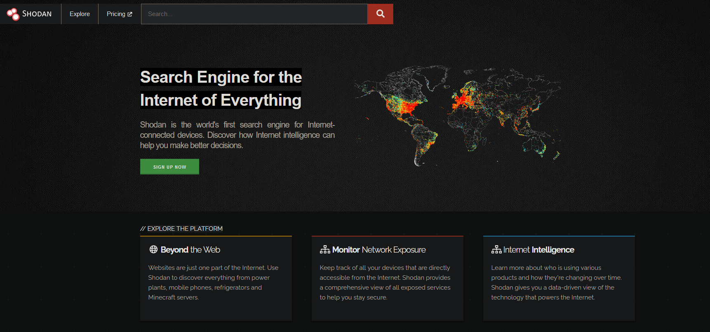
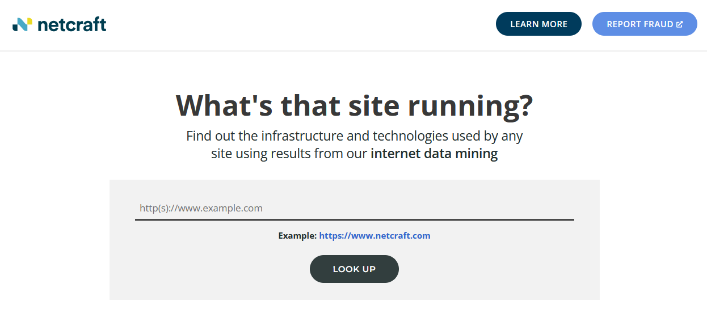
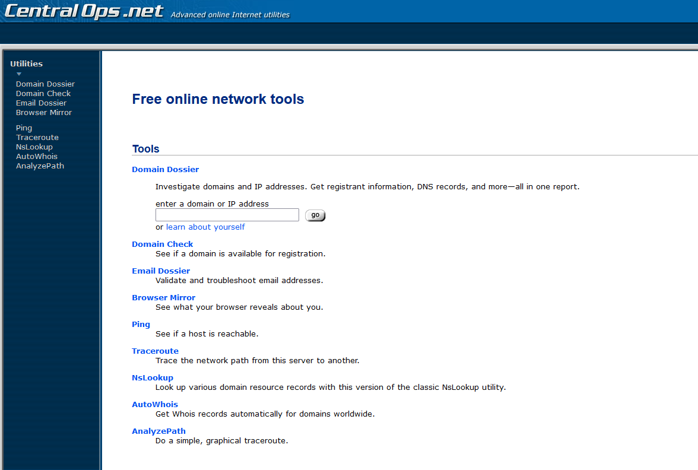
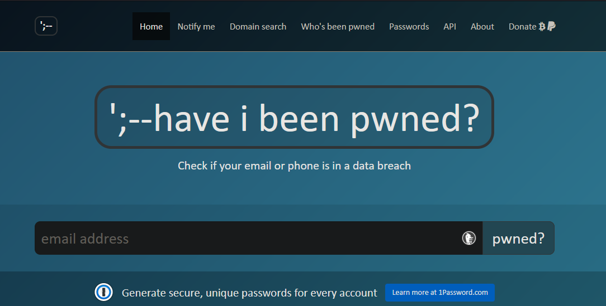
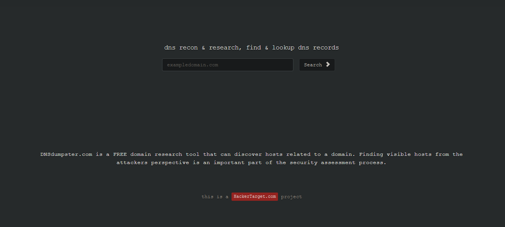
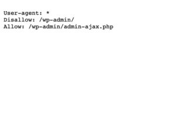
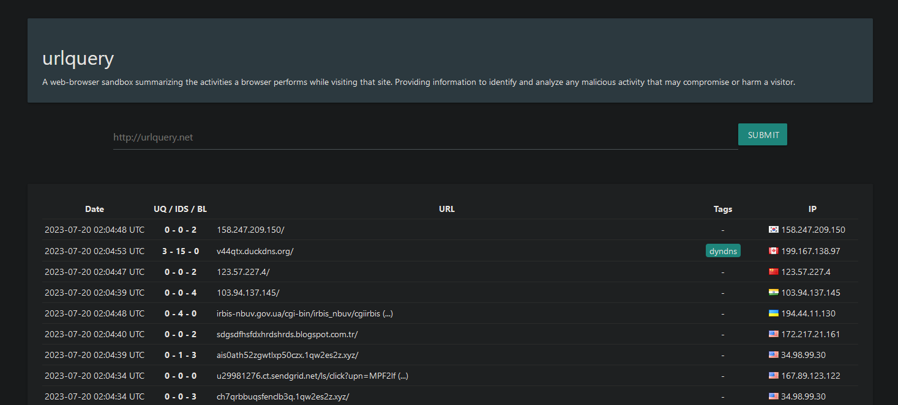

# 1. Recolección de información

El objetivo es obtener informacion relevante sobre el sistema que se va a realizar la `auditoria web`, utilizando tecnicas como footprinting, escaneo de puertos, busqueda de domineros, etc.

## Infomacion que se debe de rocopilar dutante la Auditoria

- IP's de los servidores
- Email, DNS y Dominio 
    - Cuantos sevidores tiene la empresa
    - Donde estan ubicados los Servidores
    - Cuantos Sitios web estan alojanos en un Servidor
- Recopilar archivos sensibles
    - `/robots.txt`
- Tecnologias que componen el Sitio Web

## IP's de los Servidores 

Debemos saber cual es la IP, HOSTNAME(S) y PUERTOS que tiene la Pagina Web.

| Protocolo |	Número de Puerto |	Descripción|
|--------------|--------|--------|
| IP |  |El Protocolo de Internet (IP) es el protocolo principal utilizado para el enrutamiento de paquetes en Internet.|
| TCP |		| El Protocolo de Control de Transmisión (TCP) garantiza la entrega confiable de datos en redes IP.|
| UDP | 	| El Protocolo de Datagrama de Usuario (UDP) permite la transmisión no confiable de datos en redes IP.|
| TELNET |	23	| El protocolo TELNET permite el control remoto de dispositivos a través de una conexión de red.|
| FTP	| 20/21	| El Protocolo de Transferencia de Archivos (FTP) se utiliza para la transferencia de archivos entre sistemas en una red.|
| SMTP	| 25	| El Protocolo Simple de Transferencia de Correo (SMTP) se utiliza para enviar correo electrónico a través de Internet.|
| HTTP	| 80	| El Protocolo de Transferencia de Hipertexto (HTTP) se utiliza para la comunicación en la World Wide Web.|
| DNS	| 53	| El Sistema de Nombres de Dominio (DNS) se utiliza para traducir nombres de dominio en direcciones IP.|
| BOOTP/DHCP | 	67/68	|  BOOTP (Bootstrap Protocol) y DHCP (Dynamic Host Configuration Protocol) se utilizan para asignar direcciones IP en una red.| 
|  SNMP	|  161/162	|  SNMP (Simple Network Management Protocol) se utiliza para administrar y monitorear dispositivos en una red.| 

Para poder obtener toda la informacion requeria usaremos `shodan`.
- https://www.shodan.io/

## Dominio, Email y DNS

Debemos saber quien a registrado del Dominio, donde ha sido registrado, cuantos sevidores tiene la empresa, cuantos Sitios Web estan alojanos en un Servidor y Email ralacionados a la empresa.

### Ubicacion del Dominio

| Organización | Región |
|--------------|--------|
| ARIN         | América y Sur del África |
| APNIC        | Asia |
| RIPE         | Europa y la otra parte del África |

- https://whois.domaintools.com/ : Informacion de los DNS

- https://sitereport.netcraft.com/ : Informacion de los DNS

- https://centralops.net/co/ : Informacion de los DNS

### Email Relacionados

- https://hunter.io/ : Recolegion de Correos Electronicos

- https://haveibeenpwned.com/ : Correos Hackeados

### Estructura de los DNS

Se debe conoser la estructura de los DNS en la pagina web, ya que nos puede brindara informacion de subdomineos importantes

### DNS

| Nombre Record | Tipo | Utilidad |
|--------------|--------|--------|
| Host         | A | Mapea el Domineo de una IP |
| Pointer        | PTR | Mapea una IP a un Domieo |
| NameServer      | NS | Nombre de un servidor para una zona delegada |
| Start of Authority | SOA | Configuracion para transferencia de Zonas |
| Mail Exchanger | MX | Especifica los servidores de correo |
| Text Record | TXT | Se utiliza para agregar metadatos o verificar la autenticidad de un dominio |

- https://dnsdumpster.com/ : Estructura de los DNS

## Recopilar archivos sensibles

Se puede encontrar rutas de las páginas web.

### Ejemplo 

- pagina web: `https://www.ejemplo.com/robots.txt`

Como se menciona, el archivo de texto plano denominado "robots.txt" se coloca en la carpeta raíz de un sitio web para posicionarlo en las primeras posiciones de los resultados de los motores de búsqueda.

Como autoditores, tenemos la oportunidad de recopilar información sobre las páginas indexadas que tiene la página web, lo que nos permitirá obtener aún más información.

## Tecnologias que componen el Sitio Web

En este punto queremos saber como se creado la pagina web, que herramientas se han utilizado

- https://www.wappalyzer.com/

## Analicios Opcionales

### Reputacion de la pagina web

- https://www.urlquery.net/

